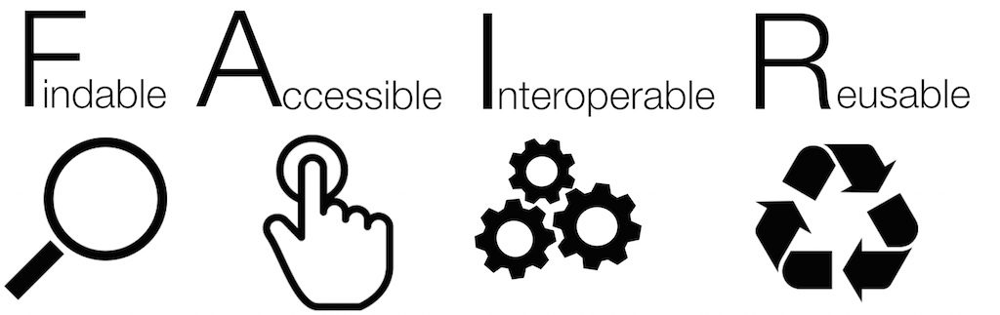

On this note repository you can find informations on how to find your way around the CCRP data structure on ERDA, and how to transfer data back and forth between ERDA, Computerome and computers. Available pages are listed to the left.

For details on CCRP plese visit:
[Collaborative Crop Resileince Project](https://ccrp.vcl.ncsu.edu/) homepage

### Findable
To facilitate data sharing within and between the three sister project of CCRP we here describe a common data storage and sharing framework.
In short, data should be managed between the platforms ERDA, Github and Biolomics. All generated raw data, processed data and results should be stored at ERDA. Scripts used for processing the raw data and generating results should be stored at Github. Metadata, and other data where the format allows it, should be stored in the Biolomics platform. All associated data should be tracable between repositories, meaning that metadata in Biolomics should point to the ERDA and Github and vice versa.

&nbsp;

&nbsp;

*This project is under active development*

&nbsp;

